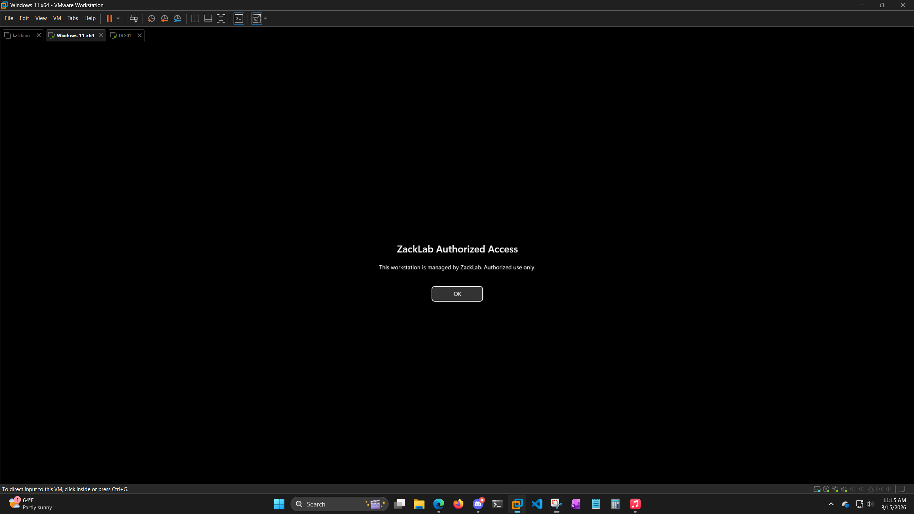
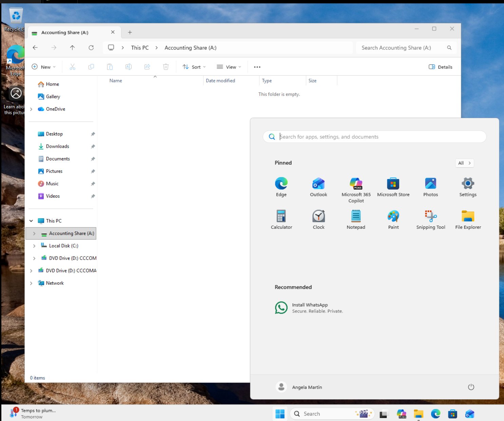
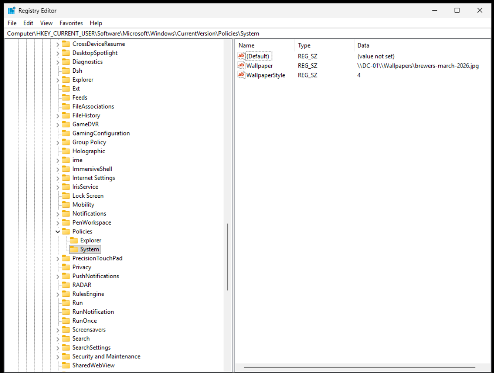

# ZackLab: Windows AD Project Logs

This is where I'm tracking my progress building out a simulated corporate network (ZackLab) to learn Active Directory, Group Policy, and PowerShell.

---

## Phase 1: The Foundation (Host & VM Setup)
- **Host Specs:** AMD Ryzen 9 7900X (12-Core) | 32GB DDR5 RAM.
- **Hypervisor:** VMware Workstation Pro.
- **VM OS:** Windows Server 2022.
- **The Install:** I skipped the "Easy Install" in VMware so I could handle the setup manually. 
- **Networking:** Set the VM to NAT. Assigned a static IP to the DC and pointed DNS to its own loopback address (127.0.0.1). 
- **Promotion:** Promoted to Domain Controller for `zacklab.local`. Verified it was healthy with `nslookup`.

---

## Phase 2: Building the Corporate Identity (ZackLab_Corp)
I wanted the lab to feel like a real company, so I built a `ZackLab_Corp` parent OU and broke it down by departments: `Accounting`, `IT`, `Sales`, and `HR`.

### The Manual Build
I started by manually creating accounts for Accounting (Kevin Malone, Angela Martin, Tara Thompson) and IT (my own `zadmin` account and Ryan Howard). 
- **Focus:** Nailing the naming conventions (`kmalone`, `amartin`) and making sure the Description and Title fields were filled out correctly.

### Scaling with PowerShell
Once I got the hang of the manual process, I used PowerShell ISE to bulk-import the Sales and HR teams (Michael, Dwight, Jim, and Pam). 
- **The Logic:** I wrote a loop that handled the UPN, job titles, and forced a password change on the first login. It’s way faster than clicking through the UI dozens of times once the company starts growing.
  
### Visual Proof


---

## Troubleshooting: The Internet & Subnet Headache
While I was verifying the new accounts, I realized the DC was totally offline—no internet, and the DNS forwarders were just timing out.

* **The Problem:** I found a subnet mismatch. I had the DC set to **192.168.10.10**, but VMware’s NAT service was trying to run everything on the `192.168.153.x` range. They weren't even on the same "street."
* **The Fix:** I had to go into the **VMware Virtual Network Editor** and manually force the Subnet IP to `192.168.10.0` so it would actually talk to my VM.
* **The DHCP Trap:** While I was messing with it, Windows "fixed" the connection by enabling DHCP, which immediately wiped out my static IP and broke the domain's brain. I had to go back in, kill DHCP, re-apply **192.168.10.10**, and point the Preferred DNS back to the loopback (`127.0.0.1`).
* **The Result:** It’s finally stable. Pings to `8.8.8.8` are solid, and `nslookup google.com` is resolving perfectly through the forwarders.

---

## Troubleshooting: The "Logon Battle"
I hit a major wall trying to get standard users to log into the DC for testing. Even after editing the "Allow log on locally" policy in the GPO, the server kept kicking me out with a "Method not allowed" error.

**How I fixed it:**
1. **The GPO Fight:** I tried running `gpupdate /force` about a dozen times, but the settings wouldn't "stick." I used `rsop.msc` and saw the local security policy was still winning over my domain changes.
2. **The "Nuclear" Fix:** I went into the GPMC and **Enforced** the Default Domain Controllers Policy, then did a full server restart to clear the cache.
3. **The Workaround:** I used a classic SysAdmin trick to verify the identity was working by adding Kevin Malone to the **Print Operators** group. Since that group has hard-coded rights to log into DCs, it bypassed the GPO hang-up immediately and proved the domain was healthy.

---

## Phase 3: Security Groups & File Shares (AGDLP)

With identity and structure locked in, I moved into what I consider the real core of Active Directory: access control.  
The goal of this phase was to understand (and prove) how Windows decides whether a user should be allowed to access a resource — using groups, not individual users.

I followed the AGDLP model throughout:

- **A**ccounts (users)
- **G**lobal groups (department membership)
- **D**omain **L**ocal groups (resource access)
- **P**ermissions (NTFS + share)


Users never touch permissions directly. Groups do.

---

### Departmental Share Design

I created a central share structure at: C:\Shares


Each department received its own folder:
- Accounting
- HR
- IT
- Sales

For every department, I used the same group pattern:
- `GG_<Dept>_Users` (Global)
- `DL_<Dept>_Files_RW` (Domain Local – Modify)
- `DL_<Dept>_Files_RO` (Domain Local – Read)

Global groups represent *who someone is*.  
Domain Local groups represent *what they can touch*.

---

### Accounting (Manual Build & Validation)

I started with Accounting to fully understand the mechanics before repeating the pattern.

Steps:
- Created Global and Domain Local groups
- Added Accounting users to `GG_Accounting_Users`
- Nested `GG_Accounting_Users` into `DL_Accounting_Files_RW`
- Assigned:
  - **Share permissions:** Change (RW), Read (RO)
  - **NTFS permissions:** Modify (RW), Read & Execute (RO)

I validated everything using **Advanced Security → Effective Access**.  
Once the group nesting and NTFS permissions were wired correctly, Kevin Malone showed Modify access without being granted Full Control — exactly as intended.

### Visual Proof


---

### HR (Manual Build + Effective Access Quirk)

I repeated the same AGDLP model for HR.

While testing, I hit a confusing situation where Effective Access initially showed no permissions, then showed the correct permissions minutes later — without any configuration changes.

Key takeaway:
- **Effective Access is a diagnostic estimate**, not a live enforcement engine
- It recalculates group nesting on demand
- A failed evaluation can show “deny” even when the ACL is correct

Re-running the test correctly showed Pam Beesly’s access to the HR share.

---

### IT (Manual Implementation)

I manually implemented IT using the same model to confirm it scaled cleanly:
- No direct user permissions
- No cross-department access
- Only IT groups present on the IT folder

By this point, the process was fully repeatable.

---

### Sales (Automated Implementation)

Once the pattern was proven, I automated the Sales department to confirm the design was scalable.

The automation:
- Created Sales Global and Domain Local groups
- Nested groups following AGDLP
- Bulk-added Sales users from the Sales OU
- Created the Sales folder and SMB share
- Applied correct Share and NTFS permissions

The setup completed in seconds and matched the manually created departments exactly.

I intentionally did not include the automation script in the repository to keep the focus on access-control design rather than code.

---


## Troubleshooting: Permissions That Look Right (But Aren’t)

Most of the issues in this phase weren’t caused by things being broken — they were caused by things being *incomplete*.

A few key problems I ran into:

* **Users with zero access despite being “in the right place.”**  
  I initially populated Global groups but forgot that they don’t grant access on their own. Until the Global group was nested into the correct Domain Local group *and* that group was present on the NTFS ACL, access was correctly denied.

* **Share permissions without NTFS permissions (and vice versa).**  
  More than once, I had one side configured correctly and the other missing. Windows requires both to allow access, and Effective Access made it very obvious when one side was missing.

* **Effective Access giving conflicting results.**  
  I saw cases where Effective Access showed no permissions, then showed the correct permissions minutes later without any configuration changes. This reinforced that Effective Access is a diagnostic estimate, not a live enforcement engine, and shouldn’t be trusted blindly.

* **Unexpected cross-department permissions.**  
  I noticed HR groups appearing on Sales and IT folders. The cause was permission inheritance or copied ACLs from the `C:\Shares` parent folder. Cleaning the parent ACL and explicitly defining permissions per department fixed the issue and prevented future leakage.

Once I slowed down and traced access from user → global group → domain local group → NTFS/share, the problems became predictable and easy to fix.


---

### Phase 3 Outcome

At this point, I’m confident I understand how Windows actually evaluates access.

Permissions are working exactly how they should:
- Users never have permissions directly
- All access flows through groups
- NTFS + Share permissions both matter
- Group nesting mistakes immediately break access (and are easy to trace once you know where to look)

I was able to build departments manually, troubleshoot broken access, and then automate the same design once it was proven. Nothing in this phase works by accident anymore — if access is denied, I know where to look and why.

This was easily the most frustrating phase so far, but also the one that made Active Directory finally “click.”


---

## Phase 4: Windows Client Integration

Today I spun up a second VM running **Windows 11 Pro** and joined it to the `zacklab.local` domain to start validating everything from a real client perspective.

### The Build
- Installed Windows 11 Pro manually (no Microsoft account, local admin only).
- Confirmed NAT networking worked.
- Set DNS manually to `192.168.10.10` (DC).
- Verified domain resolution with `nslookup zacklab.local`.
- Successfully joined the domain.

### The Logon Issue (And Why It Broke)

After joining the domain, I tried logging in as `amartin` and got:

> “The sign-in method you're trying to use isn't allowed.”

Domain Admin login worked fine, which told me:
- The trust was good.
- DNS was good.
- Authentication was working.

So the issue had to be authorization.

I used `rsop.msc` on the Windows 11 machine and found that **Default Domain Policy** was defining “Allow log on locally,” and it did NOT include `Users` or `Domain Users`.

At some point earlier, I had modified this setting while troubleshooting DC logon behavior. Because User Rights Assignment is a *replace* setting in GPO, it overwrote the default workstation behavior.

### The Fix
- Opened **Default Domain Policy** in GPMC.
- Navigated to:
  ```
  Computer Configuration → Policies → Windows Settings → Security Settings → Local Policies → User Rights Assignment
  ```
- Added `Users` back to **Allow log on locally**.
- Ran `gpupdate /force` on the Windows 11 machine.
- Rebooted.
- Verified via `rsop.msc` that the winning GPO now included `Users`.

After that, `ZACKLAB\amartin` logged in successfully.

That was a real lesson in:
- GPO scope
- Precedence
- User Rights Assignment behavior
- Authentication vs authorization

### Validating AGDLP From A Real Client

Once logged in as `amartin` (Accounting):

- She could access the **Accounting** share.
- She could NOT access **Sales** (as expected).

Then I tested token behavior:

1. While logged in, I added `amartin` to the Sales Global group.
2. Tried accessing Sales — still denied.
3. Logged out and back in.
4. Access worked.

That confirmed:
- Group membership is stamped into the token at logon.
- Tokens do not dynamically update mid-session.
- Logoff/logon regenerates the token.

Everything from Phase 3 is now validated from a real workstation.

---


## Phase 5: Workstation GPO Cleanup

This phase was about finally cleaning up the Windows side of the lab so it felt less like "everything is happening everywhere" and more like an actual managed environment.

Up to this point, I had already proven the domain join, user logons, AGDLP access, and token behavior from a real Windows 11 client. What was still missing was a cleaner workstation policy structure and some actual user/computer-level Group Policy testing.

### Creating A Real Workstations OU

The first thing I did was stop relying on the default `Computers` container and create a dedicated `Workstations` OU under `ZackLab_Corp`.

Then I moved my Windows 11 client object (`W11-CL01`) into it.

That was a small change, but an important one. It gave me a clean place to scope workstation-specific policies without mixing them into the rest of the domain.

### Building Out The GPO Structure

Once the workstation had its own OU, I created three new GPOs:

- `ZL-Workstation-Baseline`
- `ZL-User-Environment`
- `ZL-Drive-Mapping`

I linked:
- `ZL-Workstation-Baseline` to the `Workstations` OU
- `ZL-User-Environment` to `ZackLab_Corp`
- `ZL-Drive-Mapping` to `ZackLab_Corp`

This was the point where the lab finally started feeling more organized. Instead of continuing to pile settings into broad/default policy, I now had separate GPOs for:
- workstation computer settings
- user environment settings
- mapped drives

That separation alone was a huge improvement over where the lab was at the end of Phase 4.

### Workstation Baseline Test

For the first workstation policy test, I configured an interactive logon message through `ZL-Workstation-Baseline`.

The goal here was simple: prove that a computer-side GPO linked to the new `Workstations` OU was actually applying to the Windows 11 client.

At first, I thought the policy was failing, but this turned out to be a good reminder of how easy it is to test the wrong thing in Active Directory. I initially restarted the wrong machine, then verified with `gpresult /r` that the workstation GPO actually was applying to `W11-CL01`.

The reason the message still was not appearing came down to a small configuration mistake on my end: I had entered the message text, but left the message title blank. Once I corrected that, ran `gpupdate /force`, and restarted the client, the logon banner appeared as expected.

That was a good lesson in two things:
- GPO scope only matters on the correct target
- when a policy "isn't working," it may actually be applying correctly and just be configured wrong

### Visual Proof


---

### Drive Mapping Through Group Policy Preferences

After that, I moved on to drive mapping, which was one of the main goals for this phase.

Using the `ZL-Drive-Mapping` GPO, I created a mapped drive for the Accounting share:

- `A:` → `\\DC-01\Accounting`

I scoped it using **Item-level Targeting** so it only applied if the logged-in user was a member of:

- `GG_Accounting_Users`

Before setting up the policy, I manually confirmed that `amartin` could reach `\\DC-01\Accounting` from the Windows 11 client. I had to reset her password first because I had forgotten it, which honestly felt pretty realistic for help desk work.

Once the path was confirmed, I signed in as `amartin`, forced policy refresh, signed back in, and the mapped `A:` drive appeared successfully.

That was probably the most practical GPO in the whole phase because it tied together:
- user-side policy processing
- security group targeting
- share access
- real client validation

### Visual Proof


---

### User Environment Wallpaper Test

For the user environment GPO, I wanted something visual and easy to verify, so I tested desktop wallpaper deployment.

I created a shared folder on the domain controller to host the image and used a Milwaukee Brewers March 2026 wallpaper as the test file. I framed it like a simple internal seasonal desktop deployment just to make the lab feel a little less generic.

The wallpaper policy was configured through `ZL-User-Environment` using the UNC path to the shared image.

Visually, the result on the Windows 11 client was a black background instead of the image itself. At first that looked like a failure, but after checking the registry I confirmed the wallpaper policy had actually applied correctly and was pointing to the expected shared JPG.

So the GPO itself worked. The issue was the visible result on the lab workstation, most likely because the Windows 11 VM is not activated and has personalization limitations.

That ended up being useful in its own way because it showed that:
- policy application and visible user experience are not always the same thing
- registry validation can prove a policy is applying even when the screen result looks wrong

### Visual Proof



### Phase 5 Outcome

This phase cleaned up the Windows side of the lab a lot.

At the end of it, I now have:
- a dedicated `Workstations` OU
- a domain-joined Windows 11 client properly scoped for workstation policy
- a working computer-side baseline GPO
- a working drive mapping GPO targeted by security group
- a user-environment wallpaper GPO that applied successfully even though the client displayed a black background

This was a much more "real world" phase than I expected. It was less about building something flashy and more about understanding where policy lives, who it targets, how it applies, and how to prove whether it worked.

---

## Phase 5 Status

- `Workstations` OU created.
- `W11-CL01` moved out of the default `Computers` container.
- Workstation GPO structure separated from broad/default policy.
- Interactive logon banner successfully deployed through `ZL-Workstation-Baseline`.
- Accounting share mapped automatically through `ZL-Drive-Mapping`.
- Wallpaper policy applied through `ZL-User-Environment` and confirmed in registry.
- Windows side of the lab is now much cleaner and more manageable than it was in Phase 4.

Next:
- Add non-Windows devices to the ZackLab network.
- Test access behavior from macOS and Linux/Chromebook.
- Document what works, what breaks, and what differs from the Windows client experience.

---

## Notes & Known Issues

- The Windows 11 lab client is still unactivated, which appears to affect wallpaper rendering/personalization behavior.
- The wallpaper GPO applied correctly, but the desktop displayed a black background instead of the shared image.
- Only the Accounting drive map was fully tested in this phase because the goal was to prove the design.
- NAT networking remains in place for now. I chose not to move to bridged networking yet because it would add complexity without helping the project enough at this stage.
