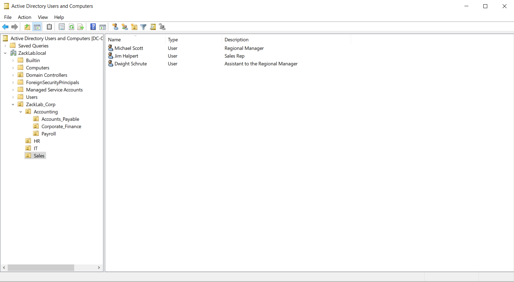
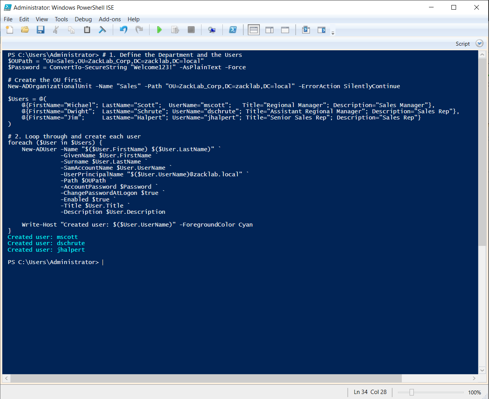
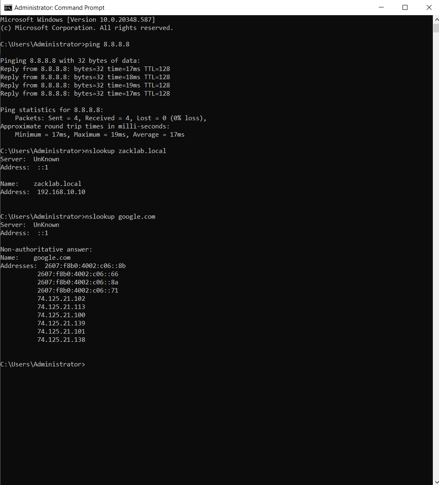
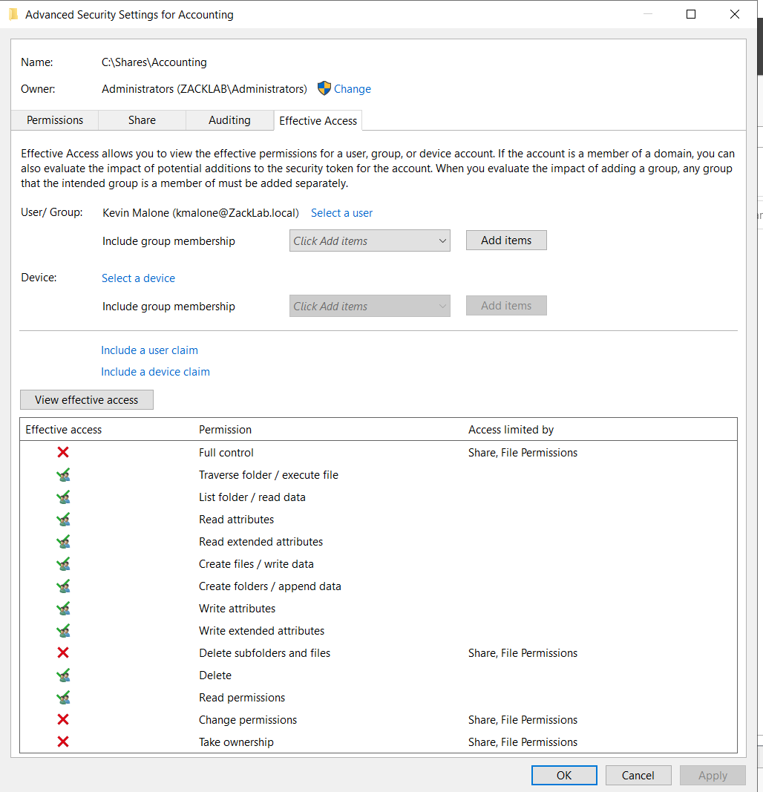

# ZackLab: Windows AD Project Logs

This is where I'm tracking my progress building out a simulated corporate network (ZackLab) to learn Active Directory, Group Policy, and PowerShell.

---

## Phase 1: The Foundation (Host & VM Setup)
- **Host Specs:** AMD Ryzen 9 7900X (12-Core) | 32GB DDR5 RAM.
- **Hypervisor:** VMware Workstation Pro.
- **VM OS:** Windows Server 2022.
- **The Install:** I skipped the "Easy Install" in VMware so I could handle the setup manually. 
- **Networking:** Set the VM to NAT. Assigned a static IP to the DC and pointed DNS to its own loopback address (127.0.0.1). 
- **Promotion:** Promoted to Domain Controller for `zacklab.local`. Verified it was healthy with `nslookup`.

---

## Phase 2: Building the Corporate Identity (ZackLab_Corp)
I wanted the lab to feel like a real company, so I built a `ZackLab_Corp` parent OU and broke it down by departments: `Accounting`, `IT`, `Sales`, and `HR`.

### The Manual Build
I started by manually creating accounts for Accounting (Kevin Malone, Angela Martin, Tara Thompson) and IT (my own `zadmin` account and Ryan Howard). 
- **Focus:** Nailing the naming conventions (`kmalone`, `amartin`) and making sure the Description and Title fields were filled out correctly.

### Scaling with PowerShell
Once I got the hang of the manual process, I used PowerShell ISE to bulk-import the Sales and HR teams (Michael, Dwight, Jim, and Pam). 
- **The Logic:** I wrote a loop that handled the UPN, job titles, and forced a password change on the first login. It’s way faster than clicking through the UI dozens of times once the company starts growing.
  
### Visual Proof

---

## Troubleshooting: The Internet & Subnet Headache
While I was verifying the new accounts, I realized the DC was totally offline—no internet, and the DNS forwarders were just timing out.

* **The Problem:** I found a subnet mismatch. I had the DC set to **192.168.10.10**, but VMware’s NAT service was trying to run everything on the `192.168.153.x` range. They weren't even on the same "street."
* **The Fix:** I had to go into the **VMware Virtual Network Editor** and manually force the Subnet IP to `192.168.10.0` so it would actually talk to my VM.
* **The DHCP Trap:** While I was messing with it, Windows "fixed" the connection by enabling DHCP, which immediately wiped out my static IP and broke the domain's brain. I had to go back in, kill DHCP, re-apply **192.168.10.10**, and point the Preferred DNS back to the loopback (`127.0.0.1`).
* **The Result:** It’s finally stable. Pings to `8.8.8.8` are solid, and `nslookup google.com` is resolving perfectly through the forwarders.

---

## Troubleshooting: The "Logon Battle"
I hit a major wall trying to get standard users to log into the DC for testing. Even after editing the "Allow log on locally" policy in the GPO, the server kept kicking me out with a "Method not allowed" error.

**How I fixed it:**
1. **The GPO Fight:** I tried running `gpupdate /force` about a dozen times, but the settings wouldn't "stick." I used `rsop.msc` and saw the local security policy was still winning over my domain changes.
2. **The "Nuclear" Fix:** I went into the GPMC and **Enforced** the Default Domain Controllers Policy, then did a full server restart to clear the cache.
3. **The Workaround:** I used a classic SysAdmin trick to verify the identity was working by adding Kevin Malone to the **Print Operators** group. Since that group has hard-coded rights to log into DCs, it bypassed the GPO hang-up immediately and proved the domain was healthy.

---

## Phase 3: Security Groups & File Shares (AGDLP)

With identity and structure locked in, I moved into what I consider the real core of Active Directory: access control.  
The goal of this phase was to understand (and prove) how Windows decides whether a user should be allowed to access a resource — using groups, not individual users.

I followed the AGDLP model throughout:

- **A**ccounts (users)
- **G**lobal groups (department membership)
- **D**omain **L**ocal groups (resource access)
- **P**ermissions (NTFS + share)

Users never touch permissions directly. Groups do.

---

### Departmental Share Design

I created a central share structure at: C:\Shares

Each department received its own folder:
- Accounting
- HR
- IT
- Sales

For every department, I used the same group pattern:
- `GG_<Dept>_Users` (Global)
- `DL_<Dept>_Files_RW` (Domain Local – Modify)
- `DL_<Dept>_Files_RO` (Domain Local – Read)

Global groups represent *who someone is*.  
Domain Local groups represent *what they can touch*.

---

### Accounting (Manual Build & Validation)

I started with Accounting to fully understand the mechanics before repeating the pattern.

Steps:
- Created Global and Domain Local groups
- Added Accounting users to `GG_Accounting_Users`
- Nested `GG_Accounting_Users` into `DL_Accounting_Files_RW`
- Assigned:
  - **Share permissions:** Change (RW), Read (RO)
  - **NTFS permissions:** Modify (RW), Read & Execute (RO)

I validated everything using **Advanced Security → Effective Access**.  
Once the group nesting and NTFS permissions were wired correctly, Kevin Malone showed Modify access without being granted Full Control — exactly as intended.

### Visual Proof

---

### HR (Manual Build + Effective Access Quirk)

I repeated the same AGDLP model for HR.

While testing, I hit a confusing situation where Effective Access initially showed no permissions, then showed the correct permissions minutes later — without any configuration changes.

Key takeaway:
- **Effective Access is a diagnostic estimate**, not a live enforcement engine
- It recalculates group nesting on demand
- A failed evaluation can show “deny” even when the ACL is correct

Re-running the test correctly showed Pam Beesly’s access to the HR share.

---

### IT (Manual Implementation)

I manually implemented IT using the same model to confirm it scaled cleanly:
- No direct user permissions
- No cross-department access
- Only IT groups present on the IT folder

By this point, the process was fully repeatable.

---

### Sales (Automated Implementation)

Once the pattern was proven, I automated the Sales department to confirm the design was scalable.

The automation:
- Created Sales Global and Domain Local groups
- Nested groups following AGDLP
- Bulk-added Sales users from the Sales OU
- Created the Sales folder and SMB share
- Applied correct Share and NTFS permissions

The setup completed in seconds and matched the manually created departments exactly.

I intentionally did not include the automation script in the repository to keep the focus on access-control design rather than code.

---

---

## Troubleshooting: Permissions That Look Right (But Aren’t)

Most of the issues in this phase weren’t caused by things being broken — they were caused by things being *incomplete*.

A few key problems I ran into:

* **Users with zero access despite being “in the right place.”**  
  I initially populated Global groups but forgot that they don’t grant access on their own. Until the Global group was nested into the correct Domain Local group *and* that group was present on the NTFS ACL, access was correctly denied.

* **Share permissions without NTFS permissions (and vice versa).**  
  More than once, I had one side configured correctly and the other missing. Windows requires both to allow access, and Effective Access made it very obvious when one side was missing.

* **Effective Access giving conflicting results.**  
  I saw cases where Effective Access showed no permissions, then showed the correct permissions minutes later without any configuration changes. This reinforced that Effective Access is a diagnostic estimate, not a live enforcement engine, and shouldn’t be trusted blindly.

* **Unexpected cross-department permissions.**  
  I noticed HR groups appearing on Sales and IT folders. The cause was permission inheritance or copied ACLs from the `C:\Shares` parent folder. Cleaning the parent ACL and explicitly defining permissions per department fixed the issue and prevented future leakage.

Once I slowed down and traced access from user → global group → domain local group → NTFS/share, the problems became predictable and easy to fix.

---

### Phase 3 Outcome

At this point, I’m confident I understand how Windows actually evaluates access.

Permissions are working exactly how they should:
- Users never have permissions directly
- All access flows through groups
- NTFS + Share permissions both matter
- Group nesting mistakes immediately break access (and are easy to trace once you know where to look)

I was able to build departments manually, troubleshoot broken access, and then automate the same design once it was proven. Nothing in this phase works by accident anymore — if access is denied, I know where to look and why.

This was easily the most frustrating phase so far, but also the one that made Active Directory finally “click.”

---

## Phase 4: Second Windows client Integration (Next)

Next steps:
- Join a second Windows client to `zacklab.local`
- Log in as standard users from different departments
- Validate real-world file access and denial
- Observe token refresh behavior vs Effective Access
- Prepare for Group Policy testing (drive mapping, basic UX controls)

---

## Notes & Known Issues
- **Internet Access:** Standard users currently don't have internet on the DC (expected due to IE Enhanced Security). I'll deal with this once we move to the Workstation/Networking phase.
